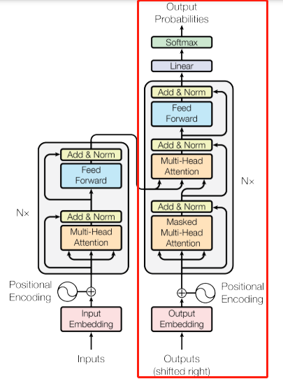

# Dependencies
- torch
- numpy
- sentencepiece
- tiktoken

# nanogpt
- This repo aims to build a small-scale custom GPT following the lecture from [Andrej Karpathy](https://www.youtube.com/watch?v=kCc8FmEb1nY).
- Data: (Tiny Shakespeare)[https://raw.githubusercontent.com/karpathy/char-rnn/master/data/tinyshakespeare/input.txt]
- Components: essentially the decoder-only transformer architecture in (Attention Is All You Need)[https://arxiv.org/abs/1706.03762]
- 1. Tokenization/Embedding: text to tensor --> experimented with 3 different tokenizers: simple character tokenizer, sentencepiece tokenizer, and tiktoken tokenizer
  2. Positional encoding
  3. Self-attention with residual connection
  4. Multi-head self-attention
  5. Block implementation
  6. FeedForward Network to learn non-linearity
  7. LayerNorm and Dropout as regularization

  

# Comparison among the tokenizers
- Simple character tokenizer (tokenizer1) had the lowest loss, followed by sentencepiece (tokenizer2), and finally tiktoken (tokenizer3). However, these losses may not be comparable due to different vocabulary sizes (tokenizer1: 65, tokenizer2: 1000, tokenizer3: 100277). On average, $Pr(next\\_token | current\\_context) = \frac{1}{vocab\\_size}$. Therefore, with a smaller vocabulary size, we expect a smaller loss.
- Larger vocabulary sizes also make training slower due to the following reasons:
- 1. Increased size of the embedding matrix which served as a look-up table for each word in the vocabulary (linearly with vocab_size) --> increased time for embedding weight updates
- 2. Increased computation for softmax of each token

# TODO
- Possible mitigation: Replace softmax with negative sampling or hierarchical softmax to reduce the computational cost of the softmax function
- WordPiece tokenizer
